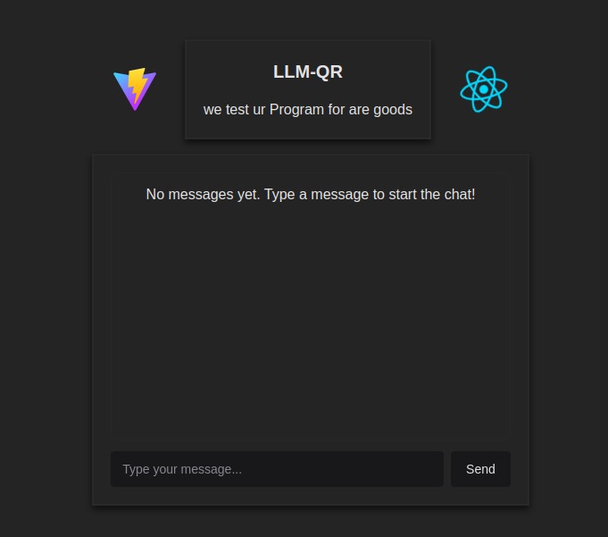
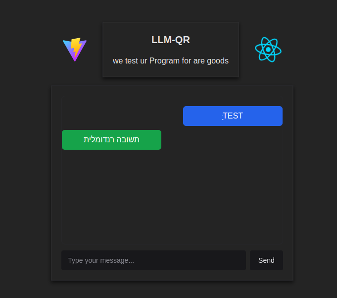

# React Chatbot Project

This project is a React-based chatbot application that sends queries to an external API (via Axios) and receives relevant responses. It utilizes **React Query** to manage the state of API requests, **TypeScript** for static typing, and **Chakra UI** for a modular and responsive user interface design. The code is structured to separate the API interaction layer (`api-client.ts`) from the main logic implemented in custom hooks (`useQueryBot` and `useQuerysBot`).

- **`useQueryBot.tsx`**: Handles a single query to the server and returns one relevant response.
- **`useQuerysBot.tsx`**: Handles a single query to the server and returns three relevant responses.

All state management for queries, including loading, error handling, and caching, is done via `react-query`. API requests are managed through `axios`. The user interface styling and layout are built with `Chakra UI`.

## Key Technologies

- **React**: Library for building user interfaces.
- **TypeScript**: Provides static typing for improved code reliability and maintainability.
- **React Query**: Manages the state of data fetching, including loading, error states, and caching.
- **Axios**: Handles HTTP requests to the server.
- **Chakra UI**: Offers ready-to-use, accessible UI components for rapid and consistent UI development.

## File Structure (Based on the Provided Screenshot)

```
src
│
├─ assets/
│
├─ compon/
│  ├─ Chat.tsx
│  └─ UICard.tsx
│
├─ hooks/
│  ├─ useQueryBot.tsx
│  └─ useQuerysBot.tsx
│
├─ services/
│  ├─ TS/
│  │  └─ api-client.ts
│  └─ react.svg
│
├─ components/
│  └─ ui/
│
├─ App.css
├─ App.tsx
├─ index.css
├─ main.tsx
├─ output.css
├─ vite-env.d.ts
│
├─ .gitignore
├─ eslint.config.js
├─ index.html
├─ package-lock.json
├─ package.json
├─ README.md
├─ tsconfig.app.json
├─ tsconfig.json
├─ tsconfig.node.json
└─ vite.config.ts
```

## Installation

Before you begin, ensure that **Node.js** and **npm** are installed. If not, you can download them from [Node.js Downloads](https://nodejs.org/).

1. Clone the repository or download it as a ZIP file and extract it locally.
2. Navigate to the project directory and run:

   ```bash
   npm install
   ```

   This command will install all dependencies listed in `package.json`, including React, React Query, Axios, TypeScript, and Chakra UI.

## Running the Project

After installing the dependencies, start the development server:

```bash
npm run dev
```

Once the command finishes, you’ll receive a local development URL, typically: [http://localhost:5173/](http://localhost:5173/).

Open this link in your browser to see the project in action.

## Screenshots

**Screenshot 1: Application Home Screen**  


**Screenshot 2: Query Results**  


## Notes

- The custom hooks manage queries and data processing from the server in a centralized manner.
- `react-query` simplifies handling loading states, caching, and error handling.
- `axios` provides a straightforward way to perform HTTP requests to the server based on the base URL configured in `api-client.ts`.
- `Chakra UI` simplifies UI development with ready-to-use, accessible components.

## Contributing & Feedback

- Feel free to open issues and submit pull requests to improve or extend the project.
- Feedback is welcome to enhance code quality and the user experience.

---
